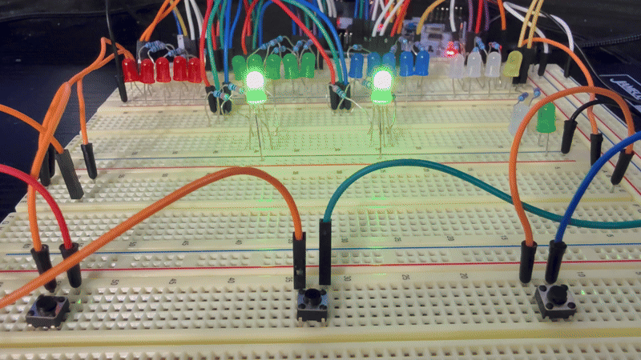

# RGB Color Match + Customizer

A two-in-one embedded color game built on STM32

## Project Overview
**RGB Color Match + Customizer** is an embedded game project using the **STM32L476RG microcontroller**. It features two distinct games
1. RGB Color Match - A puzzle game where players have to manually adjust RGB values to match another LED's color
2. RGB Color Customizer - A sandbox game where players can freely mix RGB values to create/customize colors

# RGB Color Match
words

# RGB Color Customizer

