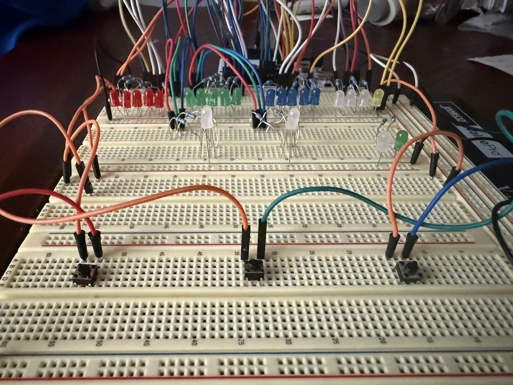
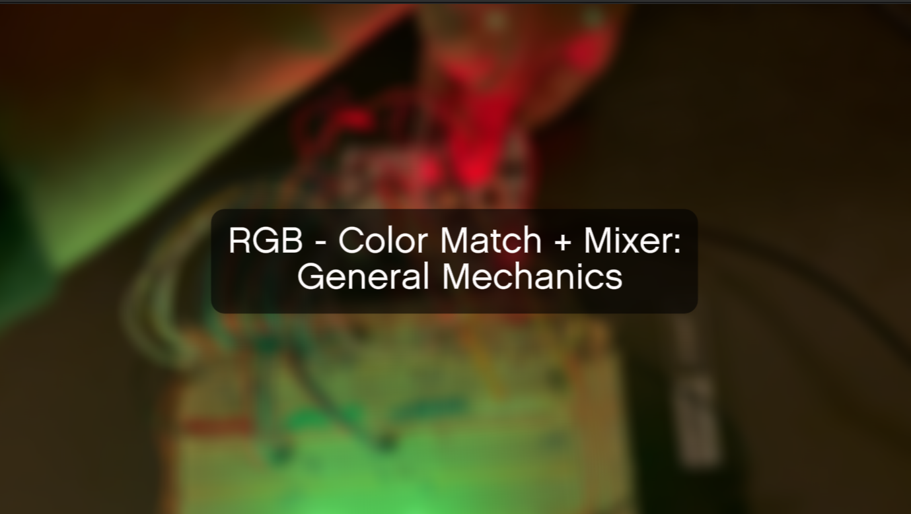
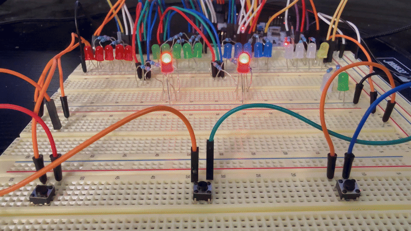
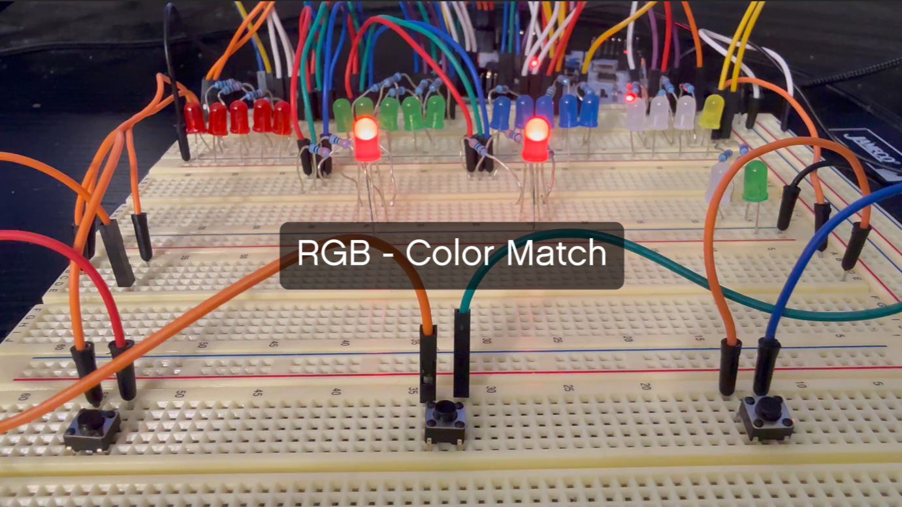
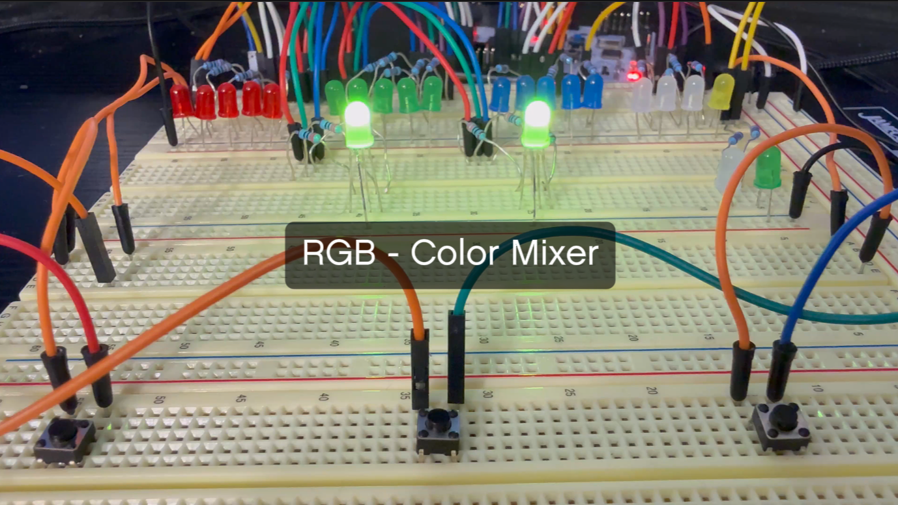

# RGB Color Match + Mixer (Work in Progress)

A modular embedded gaming platform built on STM32

## Project Overview
An **embedded game platform** built on the STM32L476RG microcontroller that uses RGB LEDs and pushbuttons to deliver interactive gameplay. Currently supports two games: **Color Match** and **Color Mixer**, with room to grow into a full suite of RGB-based mini-games.

## General Platform Mechanics + Features
These features are shared across both **Color Match** and **Color Mixer** modes:  

<table>
  <tr>
    <td>
      
    </td>
  </tr>
  <tr>
    <td><strong>Demo</strong></td>
  </tr>
</table>

- **Visual Feedback:** LED animation is used to provide real-time visual cues.
  - **Start screen animations:** Immediately reflects the selected mode, so users always know which mode is active before starting.  
  - **Brightness Bars:** Visual representation of RGB intensity levels.
- **Interactive Buttons:** Start the game or adjust RGB channels during gameplay
- **Mode Selection via User Button:** The special onboard button allows users to switch between Color Match and Color Mixer on the start screen. 

## RGB Color Match
A puzzle game where players have to manually adjust RGB values to match another LED's color

### Features
🎮 **Puzzle Solving Gameplay** 
- Players have to configure each three RGB channels to match a target color.
- Each new color provides a fresh puzzle to solve with no set rounds or limits.  

💡 **Hardware RNG**  
- Randomly selects from a pool of preset colors using onboard hardware RNG.
- Ensures each playthrough is unique and replayable.

🔄 **Accesibilty Options**  
- **Guided Mode:** Alerts players when an RGB channel is correctly matched.  
- **Skip Option:** Players can skip a color if stuck and continue the game without penalty.  

<table>
  <tr>
    <td>
    
    </td>
  </tr>
  <tr>
    <td><strong>Demo</strong></td>
  </tr>
</table>

## RGB Color Customizer
A sandbox game where players can freely mix RGB values to create/customize colors
 

### Features
🎮 **Sandbox Gameplay** 
- Endless creative mode where players can freely mix and experiment with RGB values.  
- No target color or win condition. Just open-ended exploration of color blending.  

🎨 **Fine tuned brightness tweaking**  
- Adjust RGB channels with precise control for subtle variations.  
- Perfect for experimenting with gradients, shades, and unique color combinations.  
<table>
  <tr>
    <td>
    
    </td>
  </tr>
  <tr>
    <td><strong>Demo</strong></td>
  </tr>
</table>

